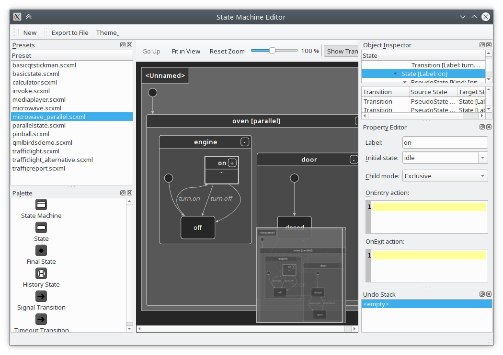
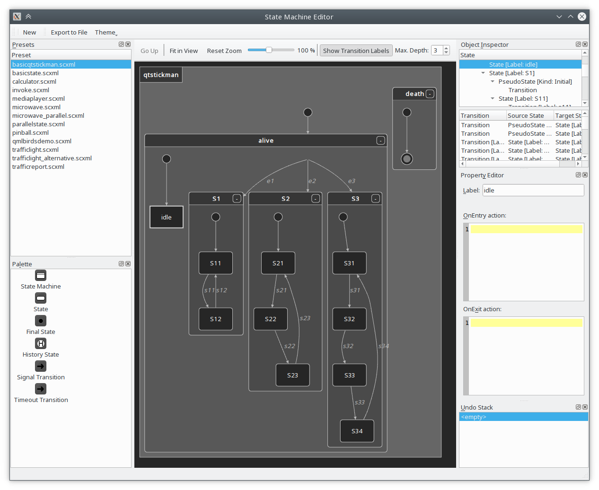
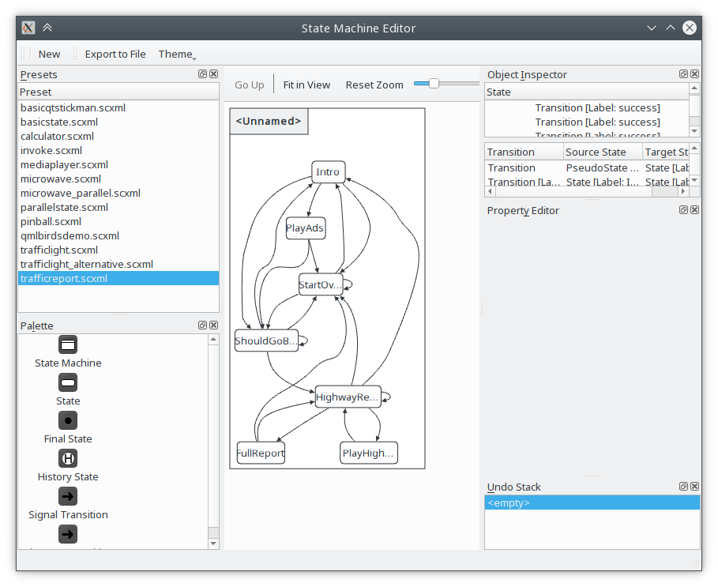
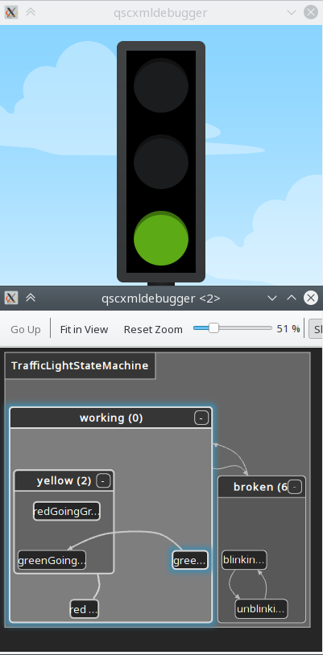

# KDStateMachineEditor - Library for visualizing and editing state charts

## Introduction

The KDAB State Machine Editor Library is a framework that can be used to
help develop full-featured State Machine Editing graphical user interfaces
and tools.  Output from such applications is in metacode or QML that can
then be used in larger Qt or QtQuick projects.

For a full description of the KDAB State Machine Editor Library, read our
wiki on GitHub, <https://github.com/KDAB/KDStateMachineEditor/wiki>.

## Screenshots

The main feature of KDStateMachineEditor is visualizing and editing state charts.

Note: A proof-of-concept application called `kdstatemachineditor` executable is part of this repository
and will be built automatically.  It can be run from the bin/ directory once the project built.

### KDSME visualizing microwave_parallel.scxml



### KDSME visualizing stickman.scxml



### KDSME visualizing trafficreport.scxml (using a different theme)



### KDSME visualizing a live-running QScxmlStateMachine



### KDSME embedded in another application (here: GammaRay)


## Features

* Internal API to create state charts
  * Consisting of states and transitions
  * Also supports history/initial states (in short: everything the SCXML spec provides)

* QML scene which shows the state charts
  * Custom items for drawing transitions using bezier curves
  * Editing: Drag & drop support, move support, etc.
  * Editing: Undo stack implementation, redo/undo actions for all operations

* Abstract interface to layout state charts
  * [GraphViz's cgraph](https://www.graphviz.org/pdf/libguide.pdf) is one of the implemented
    layouting backends (part of this repository)

* Import/Export capabilities
  * Allows to import/export .scxml files
  * Allows to export .svg files
  * Allows to export .qml files
    (in [QtQml.StateMachine](https://doc.qt.io/qt-5/qmlstatemachine.html) syntax)

* Allows to inspect running state machine instances
  * Both supports visualizing `QStateMachine` or `QScxmlStateMachine`
  * Can inspect remote applications (i.e. processes living on another machine)
  * Using [QtRemoteObjects](https://doc.qt.io/qt-5/qtremoteobjects-index.html) for communication
    * Requires the target application to be "instrumented",
      cf. the [qsmdebugger](examples/qsmdebugger/] example

* Theming support (cf. screenshots above) -- currently available are:
  * DarkTheme
  * SystemTheme

### GammaRay

KDStateMachineEditor's main user is KDAB's [GammaRay](https://github.com/KDAB/GammaRay), a tool
for introspecting Qt application.  GammaRay has the capability to display the state chart of
a `QStateMachine` embedded in the application, making it possible to inspect the live
configuration changes of the state machine, as well as zooming into child state (machines).

## Building and running

### Build

Make sure you have cmake, ninja, compiler, Qt, etc in PATH.

```bash
    mkdir build
    cd build
    cmake -G Ninja -DCMAKE_INSTALL_PREFIX=/path/where/to/install ..
    cmake --build
    cmake --build . --target install
```

Pass `-DKDSME_QT6=OFF` for a Qt 5 build.

### Start the test app

```bash
    ./bin/kdstatemachineeditor
```

See [INSTALL.txt](INSTALL.txt) for more information.

## Known Issues

The editor part of the library still is somewhat "rough"; not a lot of development time has been
spent on streamlining this feature.

## Contributing

KDAB will happily accept external contributions, but substantial contributions require a signed
[Copyright Assignment Agreement](docs/KDStateMachineEditor-CopyrightAssignmentForm.pdf).

Contact info@kdab.com for more information about the Copyright Assignment Agreement.

Please submit your contributions or issue reports from our GitHub space at
<https://github.com/KDAB/KDStateMachineEditor>

## Licensing

The KDAB State Machine Editor Library is © Klarälvdalens Datakonsult AB (KDAB),
and is licensed according to the terms of the [LGPL 2.1](LICENSES/LGPL-2.1-only.txt).

Commercial licensing terms are available in the included file
[LicenseRef-KDAB-KDStateMachineEditor.txt](LICENSES/LicenseRef-KDAB-KDStateMachineEditor.txt).

For terms of redistribution, refer to the corresponding license agreement.

## About KDAB

This State Machine Editor Library is supported and maintained by
Klarälvdalens Datakonsult AB (KDAB).

The KDAB Group is the global No.1 software consultancy for Qt, C++ and
OpenGL applications across desktop, embedded and mobile platforms.

The KDAB Group provides consulting and mentoring for developing Qt applications
from scratch and in porting from all popular and legacy frameworks to Qt.
We continue to help develop parts of Qt and are one of the major contributors
to the Qt Project. We can give advanced or standard trainings anywhere
around the globe on Qt as well as C++, OpenGL, 3D and more.

Please visit <https://www.kdab.com> to meet the people who write code like this.

Stay up-to-date with KDAB product announcements:

* [KDAB Newsletter](https://news.kdab.com)
* [KDAB Blogs](https://www.kdab.com/category/blogs)
* [KDAB on Twitter](https://twitter.com/KDABQt)
